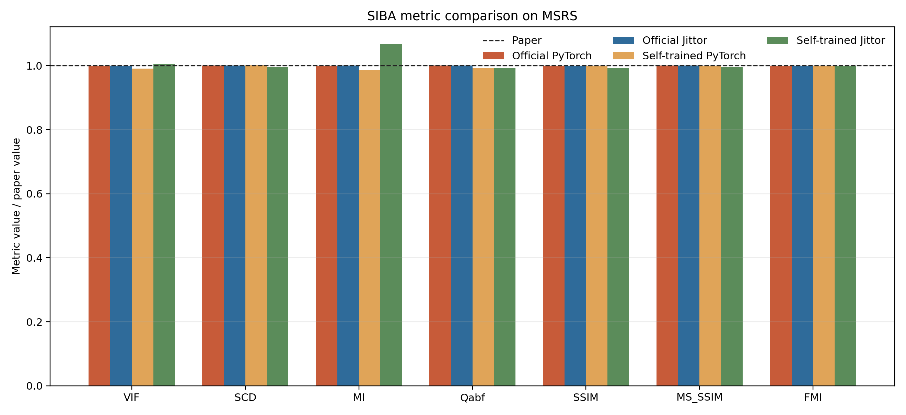
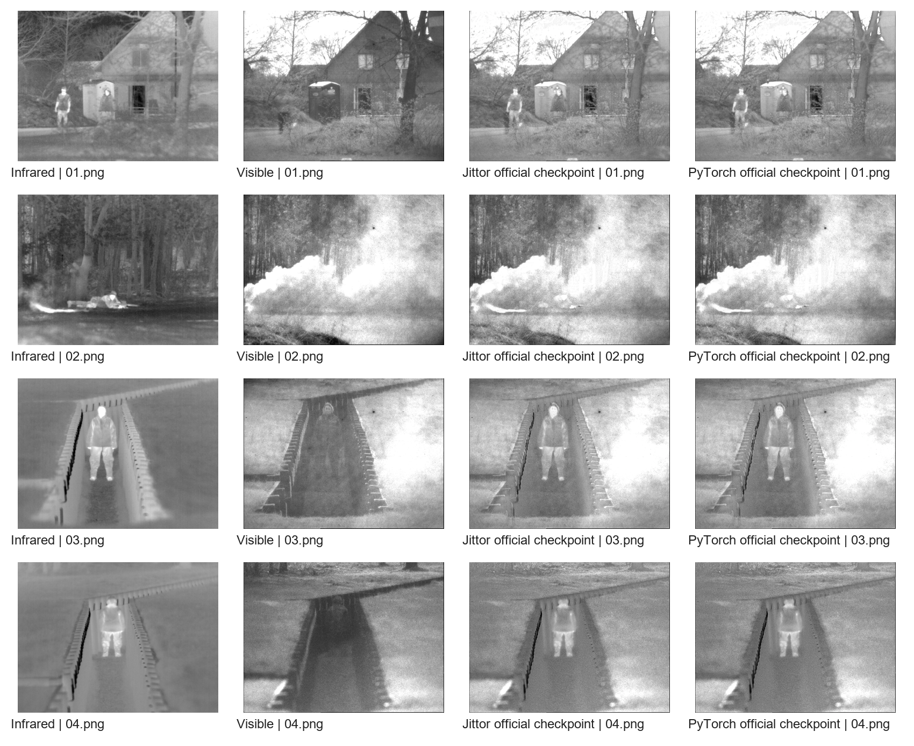

# SIBA-Jittor

Faithful Jittor reproduction of **The Source Image is the Best Attention for Infrared and Visible Image Fusion** (ICCV 2025).

- Paper: <https://openaccess.thecvf.com/content/ICCV2025/html/Wang_The_Source_Image_is_the_Best_Attention_for_Infrared_and_ICCV_2025_paper.html>
- Official PyTorch repository: <https://github.com/Afreshbird/SIBA>
- Frozen official commit: `880a1ddf9eaa610c64e5f25f87fbb146448addc9`
- Jittor: <https://github.com/Jittor/jittor>
- Reproduction repository: <https://github.com/wangshengjiao1010-boop/SIBA-Jittor>

This repository changes the deep-learning framework only. Model topology, loss terms and weights, optimizer rule, scheduler, gradient clipping, dataset loading, random cropping, training epochs, batch size, and inference color reconstruction follow the official code.

Venue, publication date, topic match, Jittor-Sprouts duplication, and public Jittor-repository checks are recorded in `docs/SELECTION_AUDIT.md`.

## Current Status

- All 13 official Python files have same-path Jittor counterparts.
- Source and symbol audit passes with no missing official file or symbol.
- Forward and loss alignment passes. Native Jittor gradients and the resulting Adam update are close under declared engineering tolerances, but strict training-step equivalence is not claimed.
- Full 60-epoch Jittor and PyTorch training on all 1,283 training pairs is complete.
- Full self-trained and released-checkpoint inference is complete in both frameworks on MSRS, half-resolution M3FD, and TNO.
- All 706 released-checkpoint output pairs have matching filenames and dimensions, with a maximum difference of one uint8 level.
- Synchronized latency, official asynchronous timing, GPU monitoring, training curves, and visual comparisons are complete.
- Final MATLAB evaluation is complete for all four framework/checkpoint combinations and all three test sets.
- Paper-value deltas, framework deltas, metric-equivalence checks, and quantitative plots are complete.

Every reported quantitative result has its fused images, per-image CSV, summary CSV, command log, and checkpoint hash retained in the repository or reproducible data workspace.

The final per-file audit is `docs/逐文件迁移最终审计_20260728.md`. The post-cleanup source audit and experiment validation are `docs/source_audit_runtime_final_20260731.json` and `docs/final_validation_20260731.json`. SHA256 integrity records covering 3,195 local source, log, checkpoint, table, curve, and full-output files are stored in `docs/artifact_manifest_final_20260731.json` and `docs/artifact_manifest_final_20260731.sha256`.

## Repository Layout

```text
official_pytorch/   Frozen official PyTorch source and released checkpoint
siba_jittor/        Same-structure Jittor implementation
configs/            Paper reference values and experiment configuration
data_manifests/     Pair lists, dimensions, and SHA256 provenance records
docs/               Source audit, dataset provenance, and protocol notes
scripts/            Environment, data, training, inference, and GPU scripts
environment/        Named Conda environment notes
tools/              Audit, alignment, logging, evaluation, and visualization tools
ppt/                Editable presentation generator and generation notes
checkpoints/        Full-training checkpoints
logs/               Raw setup, alignment, training, inference, and performance logs
results/            Fusion images, curves, metrics, and visual comparisons
```

## Hardware and Software

The paper reports an NVIDIA TITAN RTX 24 GB and Intel Core i9-9900K. This reproduction uses an RTX 3090 24 GB AutoDL instance, so accuracy is compared directly but runtime is labeled as reproduction hardware rather than paper-hardware equivalence.

| Item | Official paper/repository | Reproduction |
|---|---|---|
| GPU | TITAN RTX 24 GB | RTX 3090 24 GB |
| Python | 3.8.18 | 3.8.18 |
| PyTorch | 1.10.0+cu111 | 1.10.0+cu111 |
| Jittor | Not applicable | 1.3.11.0 |
| CUDA toolkit | 11.2 stated by repository | 11.3 toolkit; PyTorch cu111 wheel |
| Metric runtime | Linked MATLAB toolkit | MATLAB R2021b |
| Training seed | Not released | 2025 for both frameworks |

Create both named Conda environments on the AutoDL data disk:

```bash
bash scripts/setup_envs.sh
bash scripts/complete_env_setup.sh
source /root/miniconda3/etc/profile.d/conda.sh
conda activate PytorchDome
conda deactivate
conda activate JittorDome
```

The interpreters are `/root/autodl-tmp/envs/PytorchDome/bin/python` and `/root/autodl-tmp/envs/JittorDome/bin/python`. They are the Python executables inside the two Conda environments, not independent manually created interpreters. The exact installed package lists are stored in `logs/environment/` after environment capture.

The completed experiments were produced with the tested legacy prefixes `/root/autodl-tmp/envs/siba_torch` and `/root/autodl-tmp/envs/siba_jittor`. To keep those exact installed packages while using the requested names, run `bash scripts/clone_tested_envs_to_named.sh`. Runtime scripts prefer `PytorchDome` and `JittorDome` and fall back to the tested legacy prefixes.

PyCharm remote setup, interpreter switching, `screen -S kk`, inference demonstration, and GitHub synchronization are documented in `docs/PYCHARM_REMOTE_GUIDE.md`.

## Data Preparation

### Training data

| Dataset | Pairs | Use |
|---|---:|---|
| MSRS train | 1,083 | All official training pairs |
| RoadScene | 200 | Deterministic subset from 221 aligned pairs |
| Combined | 1,283 | Full 60-epoch training |

The paper and official repository do not release the selected 200 RoadScene filenames or random seed. This reproduction uses seed `2025`, records every selected filename and SHA256 value, and uses the identical manifest for PyTorch and Jittor. It does not claim that this subset is identical to the authors' undisclosed subset.

The exact source repositories, frozen commits, archive hashes, modality-directory choice, and preparation rules are documented in `docs/DATASET_PROVENANCE.md`.

### Test data

| Dataset | Pairs | Processing |
|---|---:|---|
| MSRS test | 361 | Original test resolution |
| M3FD | 300 | Paper protocol: all 300 pairs use half spatial resolution; no pair is removed |
| TNO | 45 | Complete official SIBA Google Drive set |

All final pairs pass filename and image-size checks. Machine-readable manifests are under `data_manifests/`.

Complete preparation command:

```bash
bash scripts/prepare_all_data.sh
```

This command checks out the pinned MSRS and RoadScene repositories, downloads the official SIBA-linked M3FD and TNO sources, verifies the M3FD archive SHA256, creates the deterministic RoadScene subset, prepares the 1,283-pair training directory, applies the official half-resolution M3FD preprocessing, and writes the source and combined manifests. If Google Drive is unavailable on the server, download the official archives separately and set `DOWNLOAD_ROOT` before running `scripts/materialize_official_test_sources.sh`.

Verify prepared test files against the recorded SHA256 values:

```bash
python tools/validate_dataset_manifests.py \
  --dataset MSRS=data_manifests/msrs_test.json,datasets/test/MSRS/ir,datasets/test/MSRS/vi \
  --dataset M3FD_2x=data_manifests/m3fd_2x_test.json,datasets/test/M3FD_2x/ir,datasets/test/M3FD_2x/vi \
  --dataset TNO=data_manifests/tno_test.json,datasets/test/TNO/ir,datasets/test/TNO/vi \
  --output docs/test_manifest_validation.json
```

## Source Fidelity Audit

Run:

```bash
python tools/audit_source.py \
  --official official_pytorch \
  --mirror siba_jittor \
  --output docs/source_audit_runtime.json
```

Audit result:

- Missing official files: none.
- Missing official classes/functions: none.
- Added files: only `compat/pytorch_adam.py`, `compat/pytorch_clip.py`, and package initialization.
- Added helper symbols: only framework substitutions for normalization and Kornia Laplacian.

File inventory and line counts are documented in `docs/SOURCE_AUDIT.md`. Every non-mechanical change is recorded in `MIGRATION_LOG.md`.

## Numerical Alignment

The released official PyTorch checkpoint is loaded into both implementations. The same inputs and parameters are used for layer outputs, losses, gradients, clipping, and one Adam step.

| Check | Result |
|---|---:|
| Parameter tensors / parameters | 137 / 565,941 |
| Initial parameter maximum error | 0 |
| Activation maximum absolute error | `2.0206e-4` |
| Total-loss maximum absolute error | `2.9802e-6` |
| Full pre-clip gradient cosine similarity | `0.999945` |
| Full pre-clip gradient relative L2 error | `1.0508%` |
| One-step parameter-update cosine similarity | `0.997738` |
| One-step parameter-update relative L2 error | `6.7269%` |
| PyTorch-gradient clipping maximum error | `4.8894e-9` |
| PyTorch-gradient Adam parameter maximum error | `2.9802e-8` |
| Released-checkpoint single-image PNG maximum error | `1/255` |

The historical raw report is retained unchanged at `logs/alignment/jittor_gpu_report.json`. Its original `passed: true` field did not include the native parameter-update relative error in the pass condition. The corrected tiered interpretation is stored in `logs/alignment/alignment_assessment_20260728.json`:

- Forward and loss alignment: passed.
- Migrated clipping and Adam with identical reference gradients: passed.
- Native Jittor training step: close under the declared `2%` gradient and `8%` update relative-L2 engineering tolerances.
- Strict training-step equivalence at `0.1%` relative L2: not passed.

Real `128 x 128` training crops from four image pairs match pixel-for-pixel between both loaders. Report: `logs/alignment/data_loader_report.json`.

Released-checkpoint full-dataset output comparison:

| Dataset | Images | Maximum uint8 error | Mean uint8 error |
|---|---:|---:|---:|
| MSRS | 361 | 1 | 0.002844 |
| M3FD_2x | 300 | 1 | 0.024743 |
| TNO | 45 | 1 | 0.008850 |

Per-image CSV files and summaries are stored in `results/output_alignment_20260727_siba_official_protocol/`.

## Full Training

The official settings are retained: 60 epochs, batch size 4, patch size 128, Adam, initial learning rate `1e-4`, StepLR every 25 epochs with factor 0.5, no weight decay, and global L2 gradient clipping at 0.01.

Run both frameworks consecutively in the required persistent session:

```bash
RUN_TAG=20260727_siba_official_protocol \
bash scripts/train_full_sequence_screen.sh

screen -r kk
```

Completed run:

| Framework | Epochs | Time | Checkpoint SHA256 |
|---|---:|---:|---|
| Jittor | 60 | 4,079 s (67.98 min) | `7aecde5004cb6304d6fff9b1bdb772f4fcf5876162cda28b75a8b92e8aad45c8` |
| PyTorch | 60 | 2,221 s (37.02 min) | `93ac201a9db903af19cb12f63cb3da06617449593a35b258ccaa26c5e42f2313` |

At epoch 60, the mean of the seven official logging-interval samples is `0.03463` for Jittor and `0.04364` for PyTorch. These are convergence summaries rather than paired-batch errors because the two framework data loaders do not expose identical shuffled orders.

The official `train.py` prints one loss sample every 50 batches. Each framework therefore has 420 raw loss records across all 60 epochs. The generated files are:

- `results/training_analysis_20260727_siba_official_protocol/training_samples.csv`
- `results/training_analysis_20260727_siba_official_protocol/epoch_loss.csv`
- `results/training_analysis_20260727_siba_official_protocol/loss_curve.png`
- `results/training_analysis_20260727_siba_official_protocol/loss_curve.pdf`

The curves verify full-run convergence. They are not presented as batch-wise identity because PyTorch and Jittor implement shuffled sampling differently.


## Inference and Timing

Standard synchronized inference:

```bash
python tools/run_inference.py \
  --framework jittor \
  --checkpoint checkpoints/<run>/<timestamp>/SIBA_epoch60.pkl \
  --data-dir /path/to/test/MSRS \
  --output results/jittor/MSRS \
  --use-cuda --warmup-runs 10 --timing-mode synchronized
```

The paper's official `test.py` measures CUDA calls without synchronization. To make the distinction explicit, this repository reports two timing modes:

- `synchronized`: synchronized model-forward latency; used for practical PyTorch/Jittor speed comparison.
- `official`: reproduces the unsynchronized timer in official `test.py`; used only to compare timing protocol with the paper and clearly labeled as asynchronous.

The remaining full inference and both timing protocols run under `screen -S kk`:

```bash
bash scripts/run_remaining_gpu_screen.sh
screen -r kk
```

Completed synchronized timing on RTX 3090:

| Framework | MSRS FPS | M3FD_2x FPS | TNO FPS |
|---|---:|---:|---:|
| Jittor | 9.12 | 12.66 | 6.93 |
| PyTorch | 11.99 | 19.90 | 12.31 |

The official asynchronous timing values are retained separately because they do not measure completed CUDA execution. The complete table is `results/performance_summary_20260727_siba_official_protocol/inference_timing.csv`. GPU monitoring sampled the completion run 541 times; the maximum observed device memory was 14,587 MiB.

The reproduced PyTorch asynchronous values are close to the paper on MSRS and M3FD, confirming that the official table uses this non-synchronized timer:

| Dataset | Paper FPS | Reproduced PyTorch FPS |
|---|---:|---:|
| MSRS | 132.303 | 131.733 |
| M3FD_2x | 137.271 | 133.460 |
| TNO | 126.537 | 105.868 |

The Jittor asynchronous values are not used as a speed claim because Jittor's lazy execution makes that timer even less representative of completed work. Framework comparison uses synchronized latency only.

## Live Demonstration

Four notebooks are provided:

- `demo/SIBA_PyTorch_逐模块测试.ipynb` generates the PyTorch reference for inputs, parameters, module activations, losses, gradients, clipping, and one Adam step.
- `demo/SIBA_Jittor_逐模块测试.ipynb` runs the corresponding Jittor checks and displays the measured error for each module group.
- `demo/SIBA_PyTorch_Jittor_对齐演示.ipynb` reads the real source audit, data checks, numerical alignment, 60-epoch training summaries, 706-image output comparisons, metrics, speed, and memory records.
- `demo/SIBA_Jittor_现场演示.ipynb` starts a short training run on the real 1,283-pair training directory, runs Jittor inference on real TNO images, and opens the generated outputs.

Before the short Jittor run, `scripts/demo.sh` uses the official PyTorch implementation with seed 2025 to export one shared initialization. Jittor loads that exact checkpoint before training. The checkpoint metadata and SHA256 are written under `logs/demo_shared_initial/`. This controlled initialization is only for the live demonstration and is not used for final metrics.

The short training entry keeps the official shuffle, batch size, patch size, losses, gradient clipping, and Adam rule. It only proves that the training code executes live; final metrics always come from the completed 60-epoch run.

```bash
bash scripts/demo.sh
screen -r kk
```

The complete GPU demonstration was rechecked on 2026-07-29. All four notebooks executed every code cell with zero error outputs, the live Jittor run produced a new 20-step checkpoint from the shared PyTorch initialization, and TNO inference produced 45 images. The machine-readable record is `logs/demo_module_tests/gpu_validation_summary_20260729.json`; the concise audit is `docs/GPU演示验证记录_20260729.md`.

The detailed order for IDE, training, inference, result images, logs, and GitHub is recorded in `docs/现场演示脚本_20260728.md`.

The formal experiment matrix and comparison with the SFDFusion Jittor reference are recorded in `docs/EXPERIMENT_DESIGN_AND_REFERENCE_COMPARISON.md`. The final GitHub file boundary and local archive policy are recorded in `docs/FINAL_REPOSITORY_SCOPE.md`.

## Official Metric Evaluation

The paper links `Linfeng-Tang/Evaluation-for-Image-Fusion`. The repository is frozen at commit `f5f055bcadb49c22fb734c3498aef6c56fc71f2a`, and the same MATLAB definitions are used for VIF, SCD, MI, Qabf, SSIM, MS-SSIM, and FMI.

Final evaluation was executed with MATLAB R2021b and Image Processing Toolbox functions used by the linked repository.

The linked toolkit contains two SSIM alternatives. Its active pairwise call applies the default dynamic range to `double` images scaled to `[0,255]` and gives `0.509` on TNO, which does not match the paper. Its retained `mef_ssim` implementation gives `0.931756`, which rounds to the paper's `0.932`; therefore the reported SSIM uses that paper-consistent implementation. The original function and a mathematically equivalent convolution implementation were compared with score error `1.221e-15`; the corresponding three-scale MS-SSIM error is `2.220e-16`. The FMI vectorization was also compared with the official function and produced zero score error on the controlled full-resolution sample.

```bash
python tools/run_matlab_evaluation.py \
  --matlab /path/to/matlab \
  --evaluation-dir third_party/Evaluation-for-Image-Fusion/Evaluation \
  --data-root datasets/test \
  --experiment Jittor=results/full_<tag>/jittor \
  --experiment PyTorch=results/full_<tag>/pytorch \
  --experiment OfficialJittor=results/official_checkpoint_alignment_<tag>/jittor \
  --experiment OfficialPyTorch=results/official_checkpoint_alignment_<tag>/pytorch \
  --output-dir results/metrics_<tag> \
  --resume
```

Per-image CSV files, summary CSV files, MATLAB logs, and the complete command manifest are retained. Paper values transcribed from Table 1 are stored in `configs/paper_metrics.json` and compared with:

```bash
python tools/compare_metrics_to_paper.py \
  --summary results/metrics_<tag>/metrics_summary.csv \
  --paper configs/paper_metrics.json \
  --output results/metrics_<tag>/paper_delta.csv
```

Final released-checkpoint results closely match Table 1. Small differences remain after rounding to three decimals, so the six-decimal measured values are retained below:

| Dataset | Implementation | VIF | SCD | MI | Qabf | SSIM | MS-SSIM | FMI |
|---|---|---:|---:|---:|---:|---:|---:|---:|
| MSRS | Paper | 1.061 | 1.700 | 5.111 | 0.715 | 0.981 | 0.975 | 0.933 |
| MSRS | Official PyTorch | 1.060886 | 1.700237 | 5.109932 | 0.715244 | 0.980835 | 0.975079 | 0.932670 |
| MSRS | Official Jittor | 1.060896 | 1.700205 | 5.110839 | 0.715261 | 0.980834 | 0.975080 | 0.932669 |
| M3FD_2x | Paper | 0.759 | 1.660 | 3.771 | 0.654 | 0.964 | 0.923 | 0.883 |
| M3FD_2x | Official PyTorch | 0.759281 | 1.660127 | 3.770172 | 0.653655 | 0.964490 | 0.923059 | 0.882748 |
| M3FD_2x | Official Jittor | 0.759335 | 1.660086 | 3.770833 | 0.653689 | 0.964495 | 0.923055 | 0.882752 |
| TNO | Paper | 0.836 | 1.724 | 3.508 | 0.588 | 0.932 | 0.904 | 0.914 |
| TNO | Official PyTorch | 0.835492 | 1.724495 | 3.508012 | 0.587577 | 0.931756 | 0.904369 | 0.914383 |
| TNO | Official Jittor | 0.835515 | 1.724506 | 3.507112 | 0.587575 | 0.931762 | 0.904372 | 0.914384 |

Full self-trained results from the retained 60-epoch checkpoints:

| Dataset | Framework | VIF | SCD | MI | Qabf | SSIM | MS-SSIM | FMI |
|---|---|---:|---:|---:|---:|---:|---:|---:|
| MSRS | PyTorch | 1.051570 | 1.703795 | 5.043079 | 0.709814 | 0.979919 | 0.974918 | 0.932430 |
| MSRS | Jittor | 1.066289 | 1.690859 | 5.460504 | 0.710271 | 0.973810 | 0.971632 | 0.932556 |
| M3FD_2x | PyTorch | 0.739027 | 1.723960 | 3.546561 | 0.649051 | 0.968319 | 0.934148 | 0.880840 |
| M3FD_2x | Jittor | 0.725593 | 1.670161 | 3.864333 | 0.629573 | 0.962757 | 0.923434 | 0.878365 |
| TNO | PyTorch | 0.799915 | 1.754528 | 3.162455 | 0.577163 | 0.946520 | 0.917269 | 0.911972 |
| TNO | Jittor | 0.802737 | 1.736843 | 3.334378 | 0.567382 | 0.947852 | 0.915246 | 0.911662 |

For the released checkpoint, the maximum absolute Jittor/PyTorch metric differences across all three datasets are `5.42e-5` VIF, `4.08e-5` SCD, `9.07e-4` MI, `3.42e-5` Qabf, `6.52e-6` SSIM, `4.24e-6` MS-SSIM, and `3.31e-6` FMI. This is the primary end-to-end framework fidelity result. Self-trained checkpoints are reported separately because framework data-loader shuffling and the authors' unpublished RoadScene subset prevent identical optimization trajectories.

Generated evaluation artifacts:

- `results/metrics_20260727_siba_official_protocol/metrics_summary.csv`
- `results/metrics_20260727_siba_official_protocol/paper_delta.csv`
- `results/metrics_20260727_siba_official_protocol/framework_delta.csv`
- `results/metrics_20260727_siba_official_protocol/framework_delta_max.json`
- `results/metrics_20260727_siba_official_protocol/metric_equivalence.csv`
- `results/metrics_20260727_siba_official_protocol/plots/`

The accelerated MATLAB implementations were validated against the linked official functions on a full-resolution real sample. Absolute score errors were `1.67e-15` for MEF-SSIM, `2.22e-16` for MS-SSIM, and `0` for FMI. The validation CSV also retains official and accelerated runtimes.



Representative source images and real Jittor/PyTorch outputs are arranged without altering image content under `results/visual_comparisons_20260727_siba_official_protocol/`. Both self-trained checkpoints and the released checkpoint are shown for MSRS, M3FD_2x, and TNO.



## Known Reproduction Limits

1. The authors' 200 RoadScene filenames and random seed are not public.
2. The paper states RGB-to-YCbCr training conversion, while the released training loader reads both modalities directly as grayscale. This repository follows the released code.
3. The reproduction GPU is RTX 3090 rather than the paper's TITAN RTX; runtime is not presented as same-hardware replication.
4. Full-training trajectories are stochastic across frameworks. Strong inference fidelity is established by controlled shared-parameter forward/loss tests and released-checkpoint output comparison. Native gradient and one-step update differences are reported explicitly and are not described as strict equality.

## Final Validation

Run the complete artifact audit after data preparation:

```bash
python tools/validate_experiment.py \
  --data-root datasets \
  --run-tag 20260727_siba_official_protocol \
  --require-gpu-complete \
  --require-metrics-complete \
  --output docs/final_validation.json
```

The report verifies 60 training epochs and 420 raw loss entries per framework, checkpoint existence and hashes, all 706 images for each inference branch, released-checkpoint output alignment, all 12 metric experiment/dataset pairs, and every per-image metric row.

Build the retained-artifact integrity manifest after the final files are fixed:

```bash
python tools/build_artifact_manifest.py \
  --output-json docs/artifact_manifest_20260728.json \
  --output-sha256 docs/artifact_manifest_20260728.sha256
```

## Citation

```bibtex
@InProceedings{Wang_2025_ICCV,
    author    = {Wang, Song and Han, Xie and Kuang, Liqun and Wang, Boying and Chen, Zhongyu and Qiao, Zherui and Yang, Fan and Liu, Xiaoxia and Zhang, Bingyu and Wang, Zhixun},
    title     = {The Source Image is the Best Attention for Infrared and Visible Image Fusion},
    booktitle = {Proceedings of the IEEE/CVF International Conference on Computer Vision (ICCV)},
    month     = {October},
    year      = {2025},
    pages     = {13513--13522}
}
```
