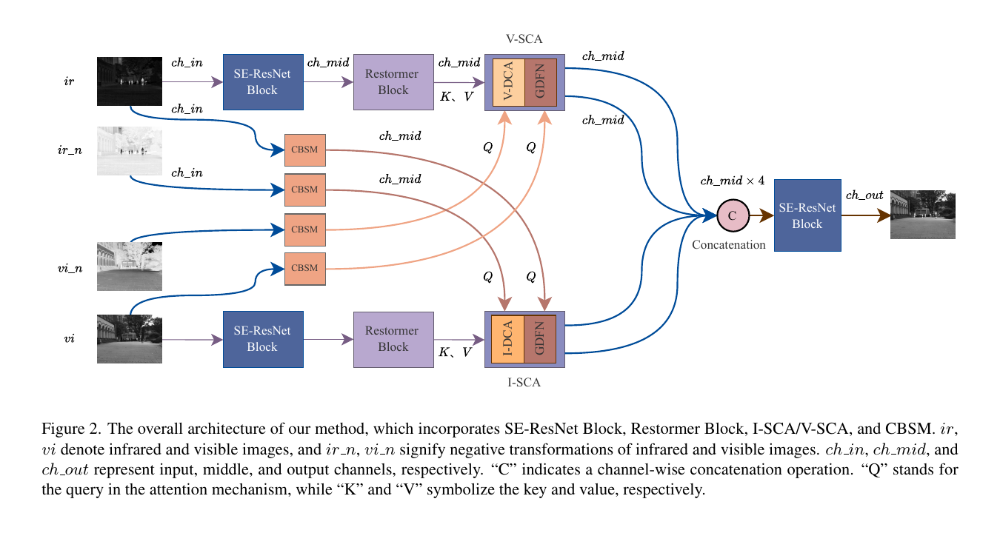

# SIBA-Jittor

Unofficial Jittor reproduction of **The Source Image is the Best Attention for Infrared and Visible Image Fusion** (ICCV 2025).

[Paper](https://openaccess.thecvf.com/content/ICCV2025/html/Wang_The_Source_Image_is_the_Best_Attention_for_Infrared_and_ICCV_2025_paper.html) | [Official PyTorch](https://github.com/Afreshbird/SIBA) | [Jittor](https://github.com/Jittor/jittor)

This repository migrates the official PyTorch implementation at commit `880a1ddf9eaa610c64e5f25f87fbb146448addc9` to Jittor. It preserves the network, losses, optimizer behavior, scheduler, gradient clipping, data protocol, 60-epoch training schedule and inference color reconstruction.



## Environment

The reproduction was tested on Ubuntu 20.04, Python 3.8.18, CUDA 11.3 and an RTX 3090 24 GB. The paper reports a TITAN RTX 24 GB.

```bash
conda create -n JittorDome python=3.8.18 -y
conda activate JittorDome
pip install -r requirements.txt
```

Core versions are pinned in [requirements.txt](requirements.txt). The captured environment is available at [logs/final/environment.txt](logs/final/environment.txt).

## Data

Datasets are not included in this repository. Download them from the official sources:

| Usage | Dataset | Pairs | Download |
|---|---|---:|---|
| Train | MSRS | 1,083 | [MSRS](https://github.com/Linfeng-Tang/MSRS/tree/main/train) |
| Train | RoadScene | 200 | [RoadScene](https://github.com/hanna-xu/RoadScene) |
| Test | MSRS | 361 | [MSRS](https://github.com/Linfeng-Tang/MSRS/tree/main/test) |
| Test | M3FD | 300 | [M3FD](https://github.com/JinyuanLiu-CV/TarDAL#download) |
| Test | TNO | 45 | [Google Drive](https://drive.google.com/drive/folders/1yURIsV9R9kEYLQovQ-vPogUkXqrIZswA) / [official SIBA links](https://github.com/Afreshbird/SIBA#-testing-datasets) |

Prepare the complete official-protocol data:

```bash
python prepare_data.py \
  --msrs-root /path/to/MSRS \
  --roadscene-root /path/to/RoadScene \
  --m3fd-root /path/to/M3FD_Fusion \
  --tno-root /path/to/TNO
```

The default output is `/root/autodl-tmp/datasets/SIBA`. Use `--output` on another machine. The prepared structure is:

```text
SIBA/
|-- train/{ir,vi}                 # 1,283 pairs
`-- test/
    |-- MSRS/{ir,vi}              # 361 pairs
    |-- M3FD_2x/{ir,vi}           # 300 pairs
    `-- TNO/{ir,vi}               # 45 pairs
```

M3FD keeps all 300 pairs and follows SIBA Section 4.1 by resizing width and height to one half. Dataset provenance, citations and SHA256 manifests are documented in [data/README.md](data/README.md).

Before running on another machine:

- Set `ir_path` and `vi_path` in [args/args_SIBA.py](args/args_SIBA.py).
- Set `model_path`, `testdata_paths` and `result_save_path` near the top of [test.py](test.py).

## Training

Optional module checks:

```bash
python tests/test_jittor_modules.py
```

Complete Jittor training:

```bash
python train.py
```

The default settings match the official code: 60 epochs, batch size 4, patch size 128, Adam learning rate `1e-4`, StepLR step 25/gamma 0.5 and global gradient clipping at `0.01`.

Each run is saved automatically:

```text
checkpoint/test/<YYYYMMDD_HHMMSS>/
|-- SIBA_epoch60.pkl
|-- train_batches.csv
`-- train_metadata.json
```

The completed checkpoint is provided at [checkpoint/SIBA_epoch60.pkl](checkpoint/SIBA_epoch60.pkl).

## Testing

Run MSRS, M3FD and TNO with the paths defined in `test.py`:

```bash
python test.py
```

Run one configured dataset only:

```bash
python test.py --dataset TNO
```

Fused images are saved to `results/jittor_test/<dataset>/`. A complete 45-image TNO output is provided in [results/demo_jittor_tno](results/demo_jittor_tno).

## Comparison

Ordinary Jittor training and testing do not require a config file. The optional [configs/comparison.yaml](configs/comparison.yaml) defines a controlled PyTorch/Jittor workflow with shared initialization, a shared 60-epoch sample/crop schedule, component-wise loss logs and all 706 test pairs.

After editing the dataset, official repository and Conda interpreter paths in the YAML file:

```bash
bash scripts/run_shared_comparison_screen.sh
screen -r kk
```

The shell script only coordinates two Conda environments, GNU screen and GPU monitoring; model and experiment parameters are stored in YAML. Details are in [docs/CONTROLLED_COMPARISON.md](docs/CONTROLLED_COMPARISON.md).

## Results

### Training logs

- [Jittor 60-epoch log](logs/final/jittor_train_60e.log)
- [PyTorch 60-epoch log](logs/final/pytorch_train_60e.log)
- [Per-epoch loss values](results/epoch_loss.csv)


### Released-checkpoint alignment

Both frameworks load the same author-released checkpoint. All 706 output pairs have matching filenames and dimensions; the maximum pixel difference is one uint8 level.

| Dataset | Framework | VIF | SCD | MI | Qabf | SSIM | MS-SSIM | FMI |
|---|---|---:|---:|---:|---:|---:|---:|---:|
| MSRS | PyTorch | 1.060886 | 1.700237 | 5.109932 | 0.715244 | 0.980835 | 0.975079 | 0.932670 |
| MSRS | Jittor | 1.060896 | 1.700205 | 5.110839 | 0.715261 | 0.980834 | 0.975080 | 0.932669 |
| M3FD_2x | PyTorch | 0.759281 | 1.660127 | 3.770172 | 0.653655 | 0.964490 | 0.923059 | 0.882748 |
| M3FD_2x | Jittor | 0.759335 | 1.660086 | 3.770833 | 0.653689 | 0.964495 | 0.923055 | 0.882752 |
| TNO | PyTorch | 0.835492 | 1.724495 | 3.508012 | 0.587577 | 0.931756 | 0.904369 | 0.914383 |
| TNO | Jittor | 0.835515 | 1.724506 | 3.507112 | 0.587575 | 0.931762 | 0.904372 | 0.914384 |

### Independent 60-epoch training

| Dataset | Framework | VIF | SCD | MI | Qabf | SSIM | MS-SSIM | FMI |
|---|---|---:|---:|---:|---:|---:|---:|---:|
| MSRS | PyTorch | 1.051570 | 1.703795 | 5.043079 | 0.709814 | 0.979919 | 0.974918 | 0.932430 |
| MSRS | Jittor | 1.066289 | 1.690859 | 5.460504 | 0.710271 | 0.973810 | 0.971632 | 0.932556 |
| M3FD_2x | PyTorch | 0.739027 | 1.723960 | 3.546561 | 0.649051 | 0.968319 | 0.934148 | 0.880840 |
| M3FD_2x | Jittor | 0.725593 | 1.670161 | 3.864333 | 0.629573 | 0.962757 | 0.923434 | 0.878365 |
| TNO | PyTorch | 0.799915 | 1.754528 | 3.162455 | 0.577163 | 0.946520 | 0.917269 | 0.911972 |
| TNO | Jittor | 0.802737 | 1.736843 | 3.334378 | 0.567382 | 0.947852 | 0.915246 | 0.911662 |

These are complete 60-epoch runs with the official settings. Because the retained runs used framework-native initialization and shuffling, they demonstrate end-to-end trainability and convergence rather than batch-wise numerical equivalence. Complete per-image metrics and MATLAB logs are available in [results/metrics_20260727_siba_official_protocol](results/metrics_20260727_siba_official_protocol) and [results/metrics_summary.csv](results/metrics_summary.csv). MATLAB is used only for the metric definitions linked by the official SIBA repository; training and inference are Python/Jittor.

### Runtime

Synchronized inference on the same RTX 3090:

| Dataset | Jittor FPS | PyTorch FPS |
|---|---:|---:|
| MSRS | 9.12 | 11.99 |
| M3FD_2x | 12.66 | 19.90 |
| TNO | 6.93 | 12.31 |

The complete timing table is [results/inference_timing.csv](results/inference_timing.csv).

### Visual comparison


Additional MSRS, M3FD and TNO comparisons are provided in [results/visual](results/visual).

## Migration

The 13 official Python files retain the same relative paths. Framework-specific substitutions are limited to Jittor APIs and compatibility helpers:

| PyTorch | Jittor reproduction |
|---|---|
| `forward` | `execute` |
| `torch.utils.data.Dataset` | `jittor.dataset.Dataset` |
| `torch.optim.Adam` | PyTorch-compatible Jittor Adam in `compat/` |
| `clip_grad_norm_` | matching global L2 clipping in `compat/` |

Source coverage, numerical alignment and limitations are documented in [MIGRATION.md](MIGRATION.md), [docs/CODE_WALKTHROUGH.md](docs/CODE_WALKTHROUGH.md) and [docs/REPRODUCIBILITY_AUDIT.md](docs/REPRODUCIBILITY_AUDIT.md).

## Citation

```bibtex
@InProceedings{Wang_2025_ICCV,
    author    = {Wang, Song and Han, Xie and Kuang, Liqun and Wang, Boying and Chen, Zhongyu and Qiao, Zherui and Yang, Fan and Liu, Xiaoxia and Zhang, Bingyu and Wang, Zhixun},
    title     = {The Source Image is the Best Attention for Infrared and Visible Image Fusion},
    booktitle = {Proceedings of the IEEE/CVF International Conference on Computer Vision (ICCV)},
    month     = {October},
    year      = {2025},
    pages     = {13513--13522}
}
```

Please also cite Jittor and the datasets used in your experiments. Dataset citations are listed in [data/README.md](data/README.md).
