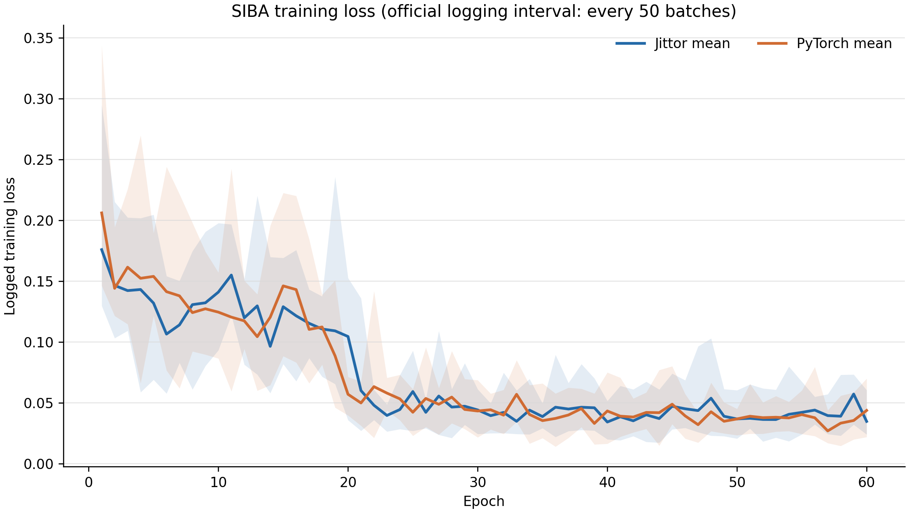
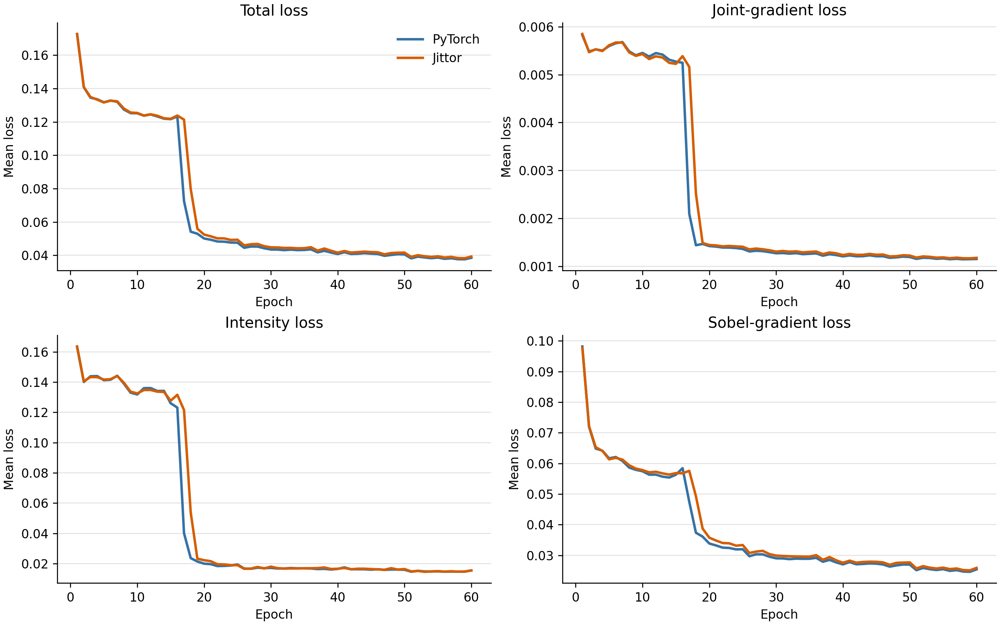
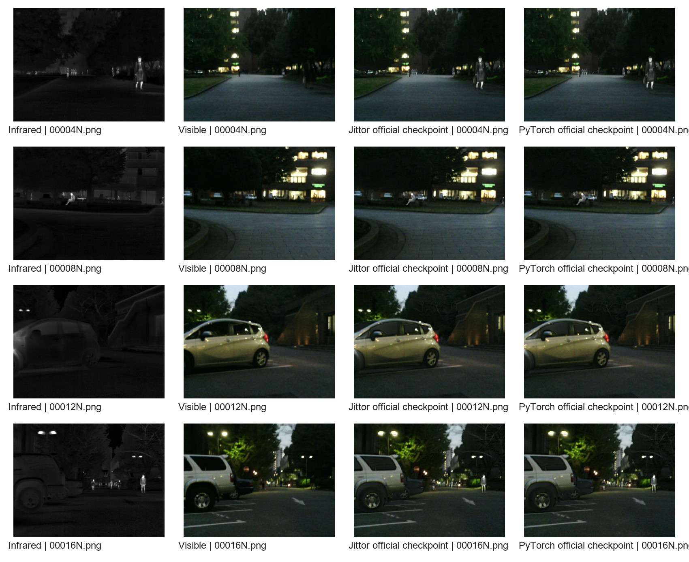
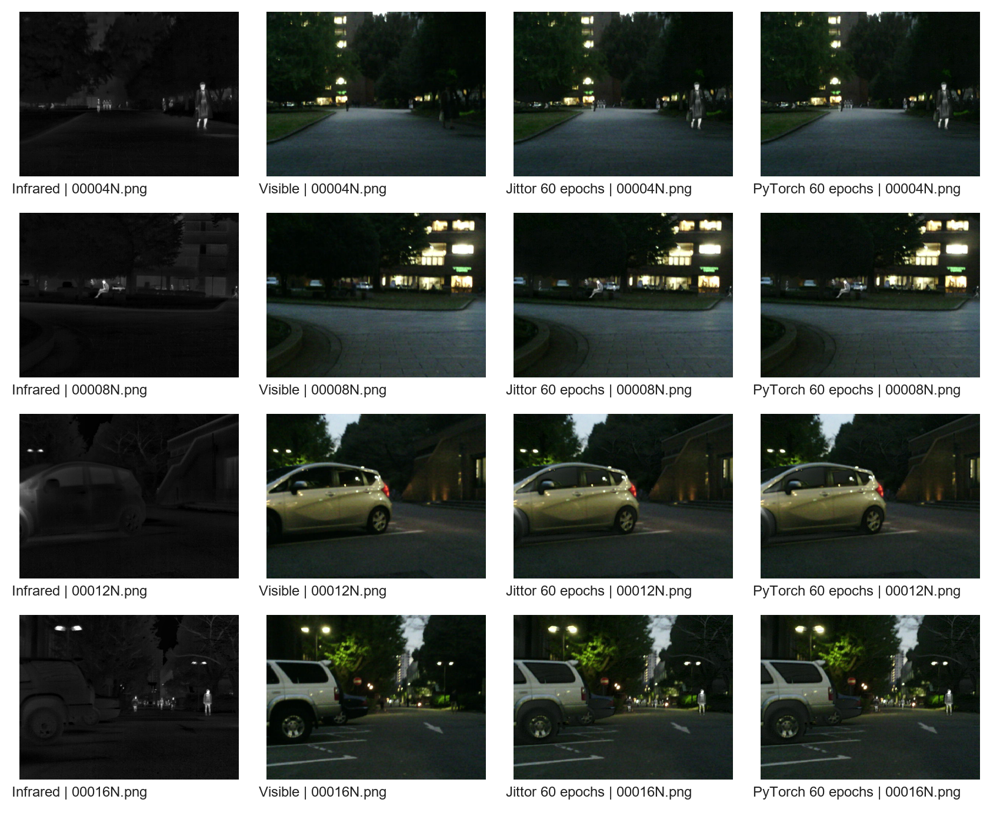

# SIBA-Jittor

Unofficial Jittor reproduction of **The Source Image is the Best Attention for Infrared and Visible Image Fusion** (ICCV 2025).

[Paper](https://openaccess.thecvf.com/content/ICCV2025/html/Wang_The_Source_Image_is_the_Best_Attention_for_Infrared_and_ICCV_2025_paper.html) | [Official PyTorch](https://github.com/Afreshbird/SIBA) | [Jittor](https://github.com/Jittor/jittor)

This repository migrates the official implementation at commit `880a1ddf9eaa610c64e5f25f87fbb146448addc9`. The network topology, three losses and their weights, optimizer equation, scheduler, gradient clipping, 60-epoch protocol, data preparation and YCbCr inference path are retained.

## Repository

```text
SIBA-Jittor/
|-- args/ base_blocks/ loader/ loss/ models/ utils/  # 13 same-path migrations
|-- compat/                 # PyTorch-compatible Adam and gradient clipping
|-- checkpoint/             # completed self-trained checkpoints
|-- data/                   # dataset protocol and SHA256 manifests
|-- datasets/               # local images (ignored except its README)
|-- evaluation/             # optional metrics and visualization tools
|-- results/                # curves, metrics, alignment and fused images
|-- tests/                  # module and cross-framework verification
|-- train.py                # complete 60-epoch Jittor training
`-- test.py                 # complete Jittor inference
```

## Environment

Tested on Ubuntu 20.04, Python 3.8.18, CUDA 11.3 and RTX 3090 24 GB. The paper reports TITAN RTX 24 GB.

```bash
conda create -n JittorDome python=3.8.18 -y
conda activate JittorDome
pip install -r requirements.txt
```

Exact package records are retained in [logs/environment](logs/environment) and [logs/final/environment.txt](logs/final/environment.txt).

If Jittor import fails with `Flags has no attribute cuda_archs`, the compiled cache is stale for the installed Jittor version. Move the cache aside and let Jittor rebuild it:

```bash
mv ~/.cache/jittor ~/.cache/jittor.stale
python -c "import jittor as jt; print(jt.__version__)"
```

## Data

Datasets are not redistributed. Download them from their official sources:

| Usage | Dataset | Pairs | Source |
|---|---|---:|---|
| Train | MSRS | 1,083 | [MSRS train](https://github.com/Linfeng-Tang/MSRS/tree/main/train) |
| Train | RoadScene | 200 | [RoadScene](https://github.com/hanna-xu/RoadScene) |
| Test | MSRS | 361 | [MSRS test](https://github.com/Linfeng-Tang/MSRS/tree/main/test) |
| Test | M3FD | 300 | [M3FD](https://github.com/JinyuanLiu-CV/TarDAL#download) |
| Test | TNO | 45 | [SIBA Google Drive](https://drive.google.com/drive/folders/1yURIsV9R9kEYLQovQ-vPogUkXqrIZswA) |

Place the original downloads under `datasets/source/` as shown in
[datasets/README.md](datasets/README.md), then prepare the complete protocol:

```bash
python prepare_data.py
```

The default output is `./datasets/SIBA` inside the repository:

```text
datasets/
`-- SIBA/
    |-- train/{ir,vi}                 # 1,283 pairs
    `-- test/
        |-- MSRS/{ir,vi}              # 361 pairs
        |-- M3FD_2x/{ir,vi}           # 300 pairs
        `-- TNO/{ir,vi}               # 45 pairs
```

M3FD retains all 300 pairs and halves width and height as required by SIBA Section 4.1. Provenance, the deterministic RoadScene subset and citations are documented in [data/README.md](data/README.md).

The prepared training directory deliberately combines MSRS and RoadScene because SIBA trains one model on both sources. Dataset files remain ignored by Git. Once the tree above exists, no absolute path needs to be edited.

## Training

Optional module smoke test (terminal checks only; no files are generated):

```bash
conda activate JittorDome
python tests/test_jittor_modules.py
```

Complete training:

```bash
python train.py
```

`python train.py` always runs the complete protocol: 60 epochs, batch size 4, 128x128 crops, Adam at `1e-4`, StepLR `25/0.5` and global L2 gradient clipping at `0.01`. Each run is kept separately:

```text
checkpoint/runs/<YYYYMMDD_HHMMSS>/
|-- SIBA_epoch60.pkl
|-- train.log
|-- train_batches.csv
|-- epoch_loss_components.csv
|-- loss_components.{png,pdf}
`-- train_metadata.json
```

The final verified checkpoint is [checkpoint/final_retrain_20260803/SIBA_epoch60.pkl](checkpoint/final_retrain_20260803/SIBA_epoch60.pkl). Its provenance and SHA256 are in [checkpoint/README.md](checkpoint/README.md). A new run writes a timestamped directory and does not overwrite this published artifact.

## Testing

`test.py` uses the newest completed checkpoint under `checkpoint/runs/`. On a fresh clone with no new run, it falls back to the published Jittor checkpoint. It tests all three configured datasets:

```bash
conda activate JittorDome
python test.py
```

Run one dataset when needed:

```bash
python test.py --dataset TNO
```

The script prints the selected checkpoint, validates infrared/visible filenames, fuses the visible Y channel, restores Cb/Cr, synchronizes CUDA timing and saves fused images, `timing.csv`, and `summary.json` under `results/jittor_test/<dataset>/`. Each summary records the checkpoint hash and input/output directories. The complete 45-image TNO output is included in [results/jittor_test/TNO](results/jittor_test/TNO).

## Experiments

The public evidence contains five complementary checks:

1. module shape and finite-value checks;
2. released PyTorch checkpoint alignment for activations, losses, gradients, one update and 706 fused images;
3. independent complete 60-epoch PyTorch and Jittor training;
4. controlled 60-epoch training from one initialization and one crop schedule;
5. qualitative comparison, seven metrics and synchronized inference timing.

The optional [configs/comparison.yaml](configs/comparison.yaml) and [scripts/run_shared_comparison_screen.sh](scripts/run_shared_comparison_screen.sh) control both frameworks with one PyTorch initialization and one shared 60-epoch sample/crop schedule. The complete `shared_seed2025` run is published under `logs/comparisons`, `checkpoint/comparisons`, `results/comparisons`, and `shared/comparisons`; its completion marker and both 19,260-row batch logs are retained. See [docs/CONTROLLED_COMPARISON.md](docs/CONTROLLED_COMPARISON.md).

## Results

### Training and performance logs

- [Jittor 60-epoch log](logs/final/jittor_train_60e.log)
- [PyTorch 60-epoch log](logs/final/pytorch_train_60e.log)
- [Training run summary](logs/final/training_summary.txt)
- [Per-epoch total loss](results/epoch_loss.csv)
- [Synchronized inference timing](results/inference_timing.csv)



The retained independent-run logs contain total loss only. The completed controlled run records total, Laplacian, intensity and Sobel losses for every batch and publishes the four curves in [results/comparisons/shared_seed2025](results/comparisons/shared_seed2025).

### Final verified Jittor rerun

After the final runtime-path cleanup, revision `126400f` was trained again for all 60 epochs and tested on all 706 pairs. The run produced 19,260 batch records, four loss-component curves, per-image metrics and synchronized timing. The checkpoint was reloaded in a new CUDA process, and no output was blank or identical to either source image.

| Dataset | Pairs | FPS | VIF | SCD | MI | Qabf | SSIM | MS-SSIM | FMI |
|---|---:|---:|---:|---:|---:|---:|---:|---:|---:|
| MSRS | 361 | 8.867 | 1.043209 | 1.717021 | 4.600446 | 0.701985 | 0.980110 | 0.972747 | 0.932252 |
| M3FD_2x | 300 | 12.707 | 0.742944 | 1.722990 | 3.656116 | 0.642761 | 0.965119 | 0.929791 | 0.880667 |
| TNO | 45 | 9.133 | 0.817349 | 1.734976 | 3.362529 | 0.569876 | 0.933072 | 0.906155 | 0.911969 |

Complete evidence and red-box qualitative comparisons are indexed in [results/final_retrain_20260803](results/final_retrain_20260803). The final checkpoint SHA256 is `9926f7c5943385e5fc57a90bd6eb2bb3b8a33b6f20de5ee6803ce41a391119d3`.

### Controlled shared-initialization training

The controlled run started both frameworks from the same exported parameter state and used the same 60-epoch filename and crop schedule. It completed 1,283 training pairs, 19,260 batches per framework and all 706 test pairs on an RTX 3090.

| Framework | Training time | Final checkpoint |
|---|---:|---|
| PyTorch 1.10.0 | 2,195 s | [SIBA_epoch60.pth](checkpoint/comparisons/shared_seed2025/pytorch/SIBA_epoch60.pth) |
| Jittor 1.3.11.0 | 4,092 s | [SIBA_epoch60.pkl](checkpoint/comparisons/shared_seed2025/jittor/SIBA_epoch60.pkl) |



Shared inputs and crop order remove two major experimental confounders, but they do not force framework arithmetic and optimizer trajectories to be identical. The final fused-image differences are therefore reported rather than hidden:

| Dataset | Pairs | Max abs. uint8 | Mean abs. uint8 | PyTorch FPS | Jittor FPS |
|---|---:|---:|---:|---:|---:|
| MSRS | 361 | 65 | 0.9847 | 12.01 | 9.13 |
| M3FD_2x | 300 | 108 | 3.0865 | 19.85 | 12.71 |
| TNO | 45 | 46 | 3.0649 | 12.28 | 6.94 |

Raw completion evidence, metadata, batch logs, per-image differences, timing CSVs and selected qualitative samples are indexed in [results/comparisons/shared_seed2025/README.md](results/comparisons/shared_seed2025/README.md). The run used code revision `99a9e2c`; later path and logging changes do not alter the model, loss, optimizer or data schedule, so retraining is not required for those engineering-only changes.

The same seven metric definitions used for the released and independent checkpoints were applied to the complete controlled outputs:

| Dataset | Framework | VIF | SCD | MI | Qabf | SSIM | MS-SSIM | FMI |
|---|---|---:|---:|---:|---:|---:|---:|---:|
| MSRS | PyTorch | 1.055237 | 1.714541 | 5.130400 | 0.710143 | 0.978958 | 0.974892 | 0.932377 |
| MSRS | Jittor | 1.066052 | 1.707117 | 5.289614 | 0.712088 | 0.975139 | 0.972079 | 0.932299 |
| M3FD_2x | PyTorch | 0.747906 | 1.710948 | 3.774727 | 0.649228 | 0.966981 | 0.931367 | 0.881405 |
| M3FD_2x | Jittor | 0.745284 | 1.702015 | 3.806073 | 0.642969 | 0.963600 | 0.928666 | 0.880173 |
| TNO | PyTorch | 0.790482 | 1.750000 | 3.094837 | 0.567956 | 0.944528 | 0.918185 | 0.912177 |
| TNO | Jittor | 0.820913 | 1.741826 | 3.153798 | 0.570551 | 0.937843 | 0.911943 | 0.912216 |

Jittor preserves more VIF and MI on MSRS and TNO, while PyTorch retains higher structure scores on several M3FD and TNO measures. These are framework trajectory differences under controlled inputs, not evidence that one framework dominates every criterion.

### Released-checkpoint alignment

Both frameworks load the same author-released PyTorch checkpoint. Across all 706 test pairs, filenames and dimensions match and the maximum pixel difference is one uint8 level (`1/255`). Per-image comparisons are retained in [results/alignment/official_checkpoint](results/alignment/official_checkpoint); activation, loss, gradient and update thresholds are recorded in [logs/alignment/alignment_assessment_final_20260728.json](logs/alignment/alignment_assessment_final_20260728.json).

The independently trained checkpoints are not identical. Their per-image output differences are retained separately in [results/alignment/self_trained](results/alignment/self_trained); these reports distinguish genuine training-trajectory differences from the expected near-equivalence of the shared author checkpoint.

| Dataset | Framework | VIF | SCD | MI | Qabf | SSIM | MS-SSIM | FMI |
|---|---|---:|---:|---:|---:|---:|---:|---:|
| MSRS | PyTorch | 1.060886 | 1.700237 | 5.109932 | 0.715244 | 0.980835 | 0.975079 | 0.932670 |
| MSRS | Jittor | 1.060896 | 1.700205 | 5.110839 | 0.715261 | 0.980834 | 0.975080 | 0.932669 |
| M3FD_2x | PyTorch | 0.759281 | 1.660127 | 3.770172 | 0.653655 | 0.964490 | 0.923059 | 0.882748 |
| M3FD_2x | Jittor | 0.759335 | 1.660086 | 3.770833 | 0.653689 | 0.964495 | 0.923055 | 0.882752 |
| TNO | PyTorch | 0.835492 | 1.724495 | 3.508012 | 0.587577 | 0.931756 | 0.904369 | 0.914383 |
| TNO | Jittor | 0.835515 | 1.724506 | 3.507112 | 0.587575 | 0.931762 | 0.904372 | 0.914384 |

### Independent complete training

| Dataset | Framework | VIF | SCD | MI | Qabf | SSIM | MS-SSIM | FMI |
|---|---|---:|---:|---:|---:|---:|---:|---:|
| MSRS | PyTorch | 1.051570 | 1.703795 | 5.043079 | 0.709814 | 0.979919 | 0.974918 | 0.932430 |
| MSRS | Jittor | 1.066289 | 1.690859 | 5.460504 | 0.710271 | 0.973810 | 0.971632 | 0.932556 |
| M3FD_2x | PyTorch | 0.739027 | 1.723960 | 3.546561 | 0.649051 | 0.968319 | 0.934148 | 0.880840 |
| M3FD_2x | Jittor | 0.725593 | 1.670161 | 3.864333 | 0.629573 | 0.962757 | 0.923434 | 0.878365 |
| TNO | PyTorch | 0.799915 | 1.754528 | 3.162455 | 0.577163 | 0.946520 | 0.917269 | 0.911972 |
| TNO | Jittor | 0.802737 | 1.736843 | 3.334378 | 0.567382 | 0.947852 | 0.915246 | 0.911662 |

These runs demonstrate complete trainability and convergence. They used framework-native initialization and shuffling, so batch-wise trajectory equality is not claimed. Complete per-image metric CSVs and logs are in [results/metrics](results/metrics). The portable provenance index is [results/metrics/evaluation_provenance.json](results/metrics/evaluation_provenance.json); the original machine-specific command record is retained as `evaluation_manifest_historical.json`. MATLAB is used only to reproduce the evaluation definitions linked by the official SIBA repository; training and inference are Python/Jittor.

### Performance

Synchronized model-forward timing on the same RTX 3090:

| Dataset | Jittor FPS | PyTorch FPS |
|---|---:|---:|
| MSRS | 9.12 | 11.99 |
| M3FD_2x | 12.66 | 19.90 |
| TNO | 6.93 | 12.31 |

The complete timing table is [results/inference_timing.csv](results/inference_timing.csv); GPU utilization and memory are summarized in [results/performance_summary_20260727_siba_official_protocol/gpu_monitor_summary.json](results/performance_summary_20260727_siba_official_protocol/gpu_monitor_summary.json).

### Visual comparison





MSRS, M3FD and TNO comparison grids are available in [results/visual](results/visual).

## Migration Notes

The 13 official Python files retain the same relative paths. `forward` becomes `execute`, PyTorch tensor/data APIs become Jittor APIs, and framework compatibility code is isolated in `compat/`. Forward and loss alignment pass the declared thresholds; native automatic-differentiation updates are close but are not strictly element-wise identical.

Details: [MIGRATION.md](MIGRATION.md), [code walkthrough](docs/CODE_WALKTHROUGH.md), [reproducibility audit](docs/REPRODUCIBILITY_AUDIT.md), and [PyCharm guide](docs/PYCHARM_REMOTE_GUIDE.md).

## Citation

```bibtex
@InProceedings{Wang_2025_ICCV,
    author    = {Wang, Song and Han, Xie and Kuang, Liqun and Wang, Boying and Chen, Zhongyu and Qiao, Zherui and Yang, Fan and Liu, Xiaoxia and Zhang, Bingyu and Wang, Zhixun},
    title     = {The Source Image is the Best Attention for Infrared and Visible Image Fusion},
    booktitle = {Proceedings of the IEEE/CVF International Conference on Computer Vision (ICCV)},
    month     = {October},
    year      = {2025},
    pages     = {13513--13522}
}
```

Please also cite Jittor and the datasets used in your experiments. Dataset citations are listed in [data/README.md](data/README.md).
