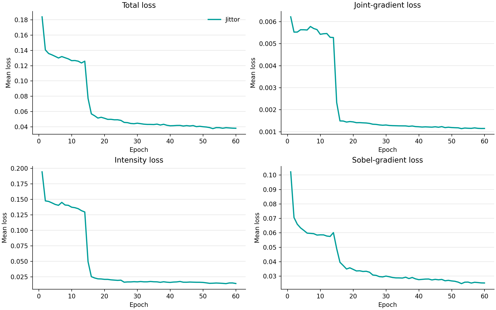
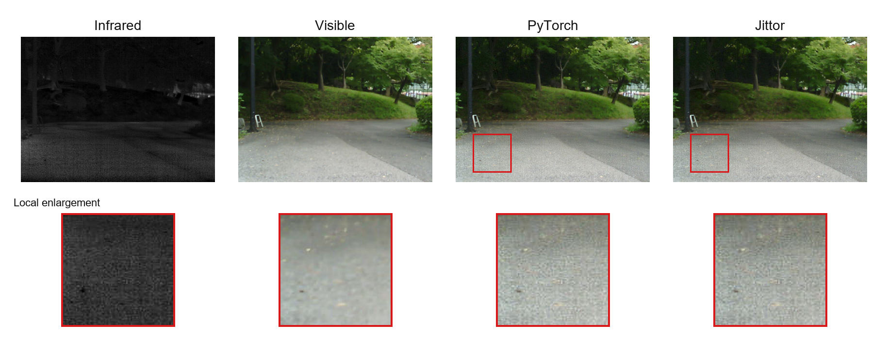
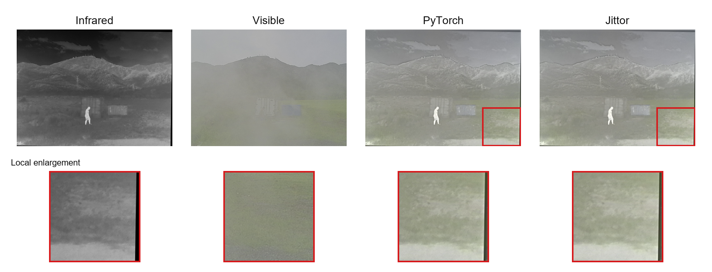
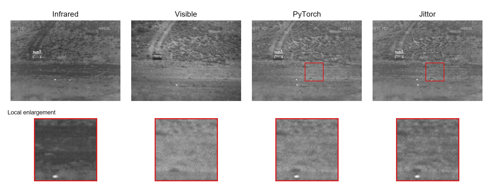

# Final Jittor Retrain, 2026-08-03

This directory records the complete validation run performed after the final code and runtime-path cleanup at revision `126400f`.

## Training

- 1,283 paired images, 60 epochs and 19,260 logged batches.
- Training time: 4,096.39 s on one RTX 3090.
- Checkpoint: `../../checkpoint/final_retrain_20260803/SIBA_epoch60.pkl`.
- Checkpoint SHA256: `9926f7c5943385e5fc57a90bd6eb2bb3b8a33b6f20de5ee6803ce41a391119d3`.
- Complete console and batch records: `../../logs/final/retrain_20260803/`.
- Total, Laplacian, intensity and Sobel curves: `training/loss_components.png`.

## Inference

`python test.py` generated and validated 706 RGB fusion images. The complete batches remain in the AutoDL run archive; this repository retains every filename-level metric, every timing row and representative source/output images.

| Dataset | Pairs | Model FPS | VIF | SCD | MI | Qabf | SSIM | MS-SSIM | FMI |
|---|---:|---:|---:|---:|---:|---:|---:|---:|---:|
| MSRS | 361 | 8.867 | 1.043209 | 1.717021 | 4.600446 | 0.701985 | 0.980110 | 0.972747 | 0.932252 |
| M3FD_2x | 300 | 12.707 | 0.742944 | 1.722990 | 3.656116 | 0.642761 | 0.965119 | 0.929791 | 0.880667 |
| TNO | 45 | 9.133 | 0.817349 | 1.734976 | 3.362529 | 0.569876 | 0.933072 | 0.906155 | 0.911969 |

## Qualitative Samples

The PyTorch column uses the independent complete 60-epoch run of the official implementation, checkpoint SHA256 `93ac201a9db903af19cb12f63cb3da06617449593a35b258ccaa26c5e42f2313`. The Jittor column uses the final checkpoint above. Red boxes mark the local region with the largest mean absolute output difference; the enlarged row shows that the files are independently generated rather than copied.

These independently trained models do not share initialization or sample order, so the comparison describes their resulting information/structure trade-offs and does not claim strict framework equivalence. The controlled same-initialization experiment remains in `../comparisons/shared_seed2025/`.
